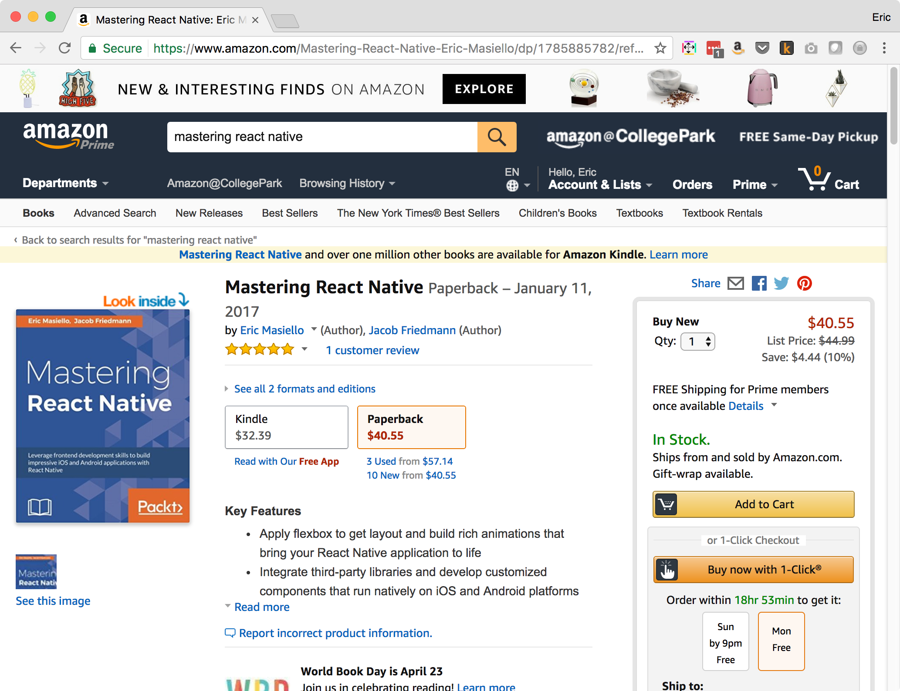
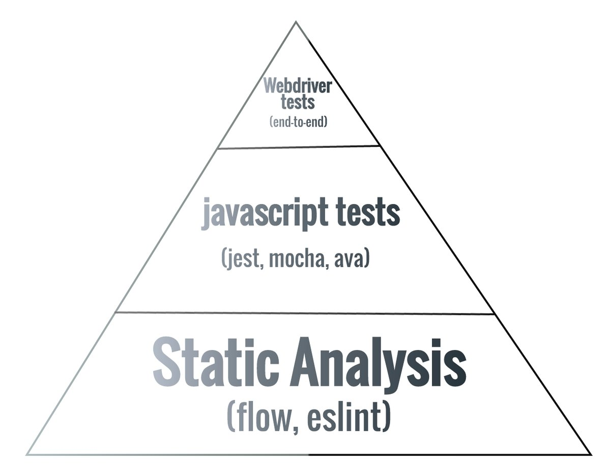

# Flow
## A beginner’s introduction (by a beginner)

---

## About me

* @ericmasiello
* eric.j.masiello@gmail.com
* Fullstack JavaScript Engineer @ Vistaprint Digital
* Co-Instructor for FEWD 31
* Co-Author of Mastering React Native

--

### Buy Me :)



<a target="_blank" href="https://www.amazon.com/gp/product/1785885782/ref=as_li_tl?ie=UTF8&camp=1789&creative=9325&creativeASIN=1785885782&linkCode=as2&tag=ericmasiello-20&linkId=0b797f6960a050d6567fd26505307fec">Mastering React Native</a>

---

## Agenda

1. TODO
2. TODO
3. TODO

---

## What is Flow?

* http://flowtype.org
* Static type checker for JavaScript
* Developed by Facebook team
* Works in browser JavaScript, Node, React Native, etc.
* Play along at home http://flowtype.org/try

--

### What is static type checking?

This generally means that the type of a variable is known at compile time. For some languages this means that you as the programmer must specify what type each variable is (e.g.: Java, C, C++); other languages offer some form of type inference, the capability of the type system to deduce the type of a variable (e.g.: OCaml, Haskell, Scala) 
— stackoverflow.

Note:
* This is different than JavaScript because once you set a variable in JavaScript - it has a type.
* But that type is not locked. You can can change it at any point.

--

### How are static types useful?

* Provides type safety
 * Catch type errors early "undefined is not a function"
* Improved developer experience (IDE integration)
 * jump to methods, autocompletion
* Aids in testing
 * Code can be analyzed

--

### Testing Pyramid


--

### Flow's built in types

* JavaScript standard library
* Browser APIs
* Node.js

Note:
Flow comes built in with support for

* Standard JS library including Promises, Generators, Proxies, Map, Sets, WeakMaps, etc.
* Browser APIs: including
Document Object Model: Events, Document object, Element, etc.
Browser Object Model (History, Location, Geolocation)
CSS Object Model: CSSStyleDeclaration, StyleSheet, MediaList
* Node: fs (file system), http, path, etc.

---

## Setup and Running

--

### Install and Configure

Install flow-bin

```bash
npm install -D flow-bin
./node_modules/.bin/flow init
```

Add `/* @flow */` to JS files you wish to check

--

### Run the Flow Server 

1. Add script to `package.json`

```
"scripts": {
  "flow": “flow",
  ...
  }
```
2. Run the script
```bash
npm run flow
```

Note:
* Running "flow" or "flow start" Spawns a background process
* Initial startup is slow
* Afterward, just type `npm run flow` and it'll be fast

---

## Flow Annotations

--

### Basic Example

```js
function sayHi(name: string): string {
	return `Hi, ${name}`;
}

sayHi('Bill'); // all good!
sayHi(22); // flow won't like this
```

--

### Primitive Types

```js
number
string
boolean
null
void // same as undefined
```

--

### Working with "optionals"
#### Default parameters in ES5

```js
// name is considered "optional"
function sayHi(name) {
	name = name === undefined ? 'Eric' : name;
	return 'Hi, ' + name;
}

sayHi('Bill'); // 'Hi, Bill'
sayHi(); // 'Hi, Eric'
```

Note:
* Quick aside - 
* In JavaScript, arguments can be considered "optional"
* Back in the ES5 days, this wasn’t truly part of the language but we could accomplish this by checking if the argument is equal to undefined.
* If it is, we can set it to a default value.

--

### Working with "optionals"
#### Default parameters in ES2015

```js
function sayHi(name = 'Eric') {
	return `Hi, ${name}`;
}

sayHi('Bill'); // 'Hi, Bill'
sayHi(); // 'Hi, Eric'
```

Note:
* ES6 or ES2015 made this pattern part of the language

--

## How would you define the type of an optional?

--

### Annotating Optionals in Flow

optionals are: `T | void`

```js
function sayHi(name?: string): string {
 // code here
}

function sayHi(name?: string = 'Eric'): string {
 // code here
}
```

Note:

* We say the type is T or void
* The type of name is basically string or void
* We express this with a "?" after the variable
* This will be used solely for types of string OR undefined. **NOT** null.
* To use nulls we create something called a *Maybe*

--

### Optionals vs. Maybes

optionals are: `T | void`
```js
function sayHi(name?: string = 'Eric') {
	return `Hi, ${name}`;
}
```

maybes are: `T | void | null`

```js
function sayHiMaybe(name: ?string = 'Eric') {
  if (name) {
    return `Hi, ${name}`;
  }
	return 'Hi stranger';
}

sayHiMaybe('Bill'); // 'Hi, Bill'
sayHiMaybe(); // 'Hi, Eric'
sayHiMaybe(null); // 'Hi, stranger'
```

Note:
* There's another concept in Flow called Maybes
* They are similar to optionals but they also support the type null
* Syntax for defining a maybe is slightly different
* In this example, because the type can be null, Flow forces us to check that name is truthy

--

### any & mixed

* `any`, aka shutup, I know what I'm doing
* `mixed`, can be any type. Requires you add the proper checks

```js
function anyTest(x: any): void {
  // sure, if you say so :)
  console.log(x.y.z);
}
  
function mixedTest(x: mixed): void {
  if(x && x.y && x.y.z) {
    console.log(x.y.z);
  }
}
```

Note:
* `any` is the default type if you do not define it and it cannot be inferred by the code

--

### Arrays

* Can define arrays of any type
* Two ways to write

```js
function addNumbers(values: number[]): number {
  return 42;
}

function theStrings(values: Array<string>): string {
  return 'hi';
}
```
--

### Objects

Generic Object type
```js
let myObj: Object;
myObj = { foo: "foo", bar: 0 };
```

Non-strict objects:
```js
let myObj: { foo: string, bar: number };
myObj = { foo: "foo", bar: 0, baz: true };
```

Strict objects:
```js
let myObj: {|foo: string, bar: number|};
myObj = { foo: "foo", bar: 0 };
```

Note:
* Non-strict - allows you to add additional properties
* Strict objects: **ONLY** allow the properties listed in the type

--

### Objects as maps

Untyped example
```js
let compSciCourses = {
  CS101: 'Computer Science 101: Intro to C',
  CS102: 'Computer Science 102: Intro to C++',
  CS201: 'Computer Science 201: Intro to Java',
  CS202: 'Computer Science 202: Advanced Java'
};
```

With type annotation
```js
let compSciCourses: {[id:string]: string} = {
  CS101: 'Computer Science 101: Intro to C',
  CS102: 'Computer Science 102: Intro to C++',
  CS201: 'Computer Science 201: Intro to Java',
  CS202: 'Computer Science 202: Advanced Java'
};
```

Note:
* Within annotation, left side represents the key, the right side are the possible values
* There's nothing special about "id", its just a convention. I've also seen "key" used in place. But you can type anything there and it'll serve the same purpose
* If you want to use non-string keys, you can't define them inline within the object

--

### Objects as maps: *Gotchas*

Non-string keys

```js
let compSciCoursesTyped: {[id:number]: string} = {
  101: 'Computer Science 101: Intro to C',
  102: 'Computer Science 102: Intro to C++',
  201: 'Computer Science 201: Intro to Java',
  202: 'Computer Science 202: Advanced Java',
}
```
This won't work :(

Note:
* If you want to use non-string keys, you can't define them inline within the object
* However, the Flow checker will throw an error - not a type error - but just an error saying *"non-string literal property keys not supported"*

--

### Objects as maps: *Work Around*

The fix:
```js
let compSciCoursesTyped: {[id:number]: string} = {};
compSciCoursesTyped[101] = 'Computer Science 101: Intro to C';
compSciCoursesTyped[102] = 'Computer Science 102: Intro to C++';
compSciCoursesTyped[201] = 'Computer Science 201: Intro to Java';
compSciCoursesTyped[202] = 'Computer Science 202: Advanced Java';
```

Note:
* This work around will work. 
* Not sure if Flow team has plans to fix the in the short term.

---

## Objects annotations are ugly.
### Introducing Type Aliases

Note:
* Doing all this stuff inline as you may have noticed can produce some pretty long line lengths
* Hard to read

--

## Type aliases

Define custom reusable types

```js
type MapOfNumbers = { [key: string]: number };
var numbers: MapOfNumbers = {
  ten: 10,
  twenty: 20,
};

type Person = {
  firstName: string,
  lastName: string
};
const eric: Person = {
  firstName: 'Eric',
  lastName: 'Masiello'
};
 
type ArrayString = string[];
const arrStrings: ArrayString = ['Hello', ‘World'];

type People = Person[];
const students: People = [{firstName: 'Eric', lastName: 'Masiello'}, {firstName: 'Jon', lastName: 'Smith'}];
```

--

## Type aliasing functions

Generic Function type

```js
function greetPerson1(id: number, lookupMethod: Function): string {
  const person: Person = lookupMethod(id);
  return `Welcome, ${person.firstName} ${person.lastName}`;
}
```

Using custom types

```js
type LookupPersonFn = (id: number) => Person;
 
function greetPerson(id: number, lookupMethod: LookupPersonFn): string {
  const person: Person = lookupMethod(id);
  return `Welcome, ${person.firstName} ${person.lastName}`;
}
```

---

## Classes

--

### <del>Annotating</del> classes

Classes become *the type*

```js
class Person {
	firstName: string;
	lastName: string;

	constructor(firstName: string, lastName: string) {
		this.firstName = firstName;
		this.lastName = lastName;
	}
	greet():string {
		return `Hello, ${this.firstName} ${this.lastName}`;
	}
}

const presenter: Person = new Person('Eric', 'Masiello');
```

Note:

* The class becomes the type you can use.
* Must annotate properties of class (e.g. `firstName`, `lastName`) (i.e. anything that you would reference with `this`)
* There exist limited support for the old school way of writing classes with functions. Its recommended you use the ES2015 class syntax

---

## Non-native types

--

### Tuples
* **Tuple:** A fixed length array of a heterogeneous type
* No such data construct in native JavaScript

```js
type CurrencyConversion = [string, string, number]
const usdToEuro: CurrencyConversion = ['USD', 'EUR', 0.95];
```

--

### Enumerations

Can be created using the union (`|`) operand

```js
type ResponseEnum = 'yes' | 'no' | 'maybe';
const myResponse: ResponseEnum = 'yes';
```

---

## Best Practices
### (And my personal recommendations)

--

### Sharing Types
* Put all your types in one file (e.g. `types.js`)
* You can then `import` and `export` them

```js
// types.js
  
export type UserID = number;
export type User = {
	id: UserID,
	name: string,
};
```

```js
// index.js
  
import type { User } from './types';
const eric: User = {
	id: 2981,
	name: 'Eric'
}
```

Note:
* On top of importing and exporting variables from various modules...
* Flow has extended ES Module syntax to allow sharing of types between modules

--

### When should I annotate?

"Flow has sophisticated type inference and it is often unnecessary to explicitly annotate your program with types"

--

### When should I annotate?

* Functions parameters and output: **Recommend**
* When the type can be inferred: **Nah**
* Boundaries of CommonJS/ES modules **Required**

Note:
* Defining a function or a method, I personally like to annotate these. its not strictly required but i find it useful
* If the type can be inferred based on the type returned from a function (e.g. `var message: string = greeting(‘hi’););` or the value explicitly assigned (e.g. `var x = 2)`, you don't need to and it probably will just clutter up your code
* If you use CommonJS modules (as you would in Node) or ES2015 modules (`import`/`export` syntax) you'll need to annotate whatever you export

--

### Required annotations
You *must* annotate module boundaries

CommonJS:

```js
module.exports = {
  greet: (name: string): string => `Hi, ${name}`
}
```

ES Modules:

```js
export function sayHi(name: string): string {
  return `Hi, ${name}`;
}
```

Note:
* This has to do with an optimization Flow does.
* A nice side effect is that Flow will now understand what was and wasn't exported from a module.
* Therefore, if you try to import something from a module that it doesn't export, flow will catch it and inform you of the error

---

## Using Flow

Note:
* We've talked at length about the language of flow
* But how do you actually use it
 * in your code editor
 * in a web app
 * in a React Native app

--

### Editor plugins

FIXME: WHAT PLUGIN AM I USING FOR VSCODE?

* Highlight errors in real time
* Allow you to jump to definitions of objects or methods
* Adds auto completion
* Hovering over functions will show you the parameter and return type
* **Mileage may vary with plugins/editors**


#### Options:
* Vim https://github.com/flowtype/vim-flow
* Emacs https://github.com/flowtype/flow-for-emacs
* Nuclide (for Atom) https://nuclide.io/docs/languages/flow/
* Sublime https://github.com/SublimeLinter/SublimeLinter-flow
* VS Code https://github.com/flowtype/flow-for-vscode

Note:
* While you'll end up leverage flow in the command line quite a bit... **real time feedback is clutch**
* Nuclide I've found to be the best. Plus Nuclide has support for a bunch of React Native stuff so if you're into React Native development, use Nuclude with Atom
* Lately I've been using VS Code a lot cuz I like the Node debugging experience. Plugins are good there too but Nuclide still feels the best to me

--

### Flow in a web app

* Must strip out annotations
* Use Babel & `babel-plugin-transform-flow-strip-types`

```js
// .babelrc
  
{
  "plugins": ["transform-flow-strip-types"]
}
```

Note:
* If you try and annotate your code and then run it in the browser, it'll obviously break
* We need to strip away those annotations before we run it in the browser
* Using Babel and the babel-plugin-transform-flow-strip-types
 * Get all the benefits of flow as we author code
 * But can strip away those annotations so browser can still understand our code
* You'll probably want to pair this with your build tool of choice (webpack, browserify, etc)

--

### Add to your testing process

```js
// package.json

"scripts": {
  "lint:script": "eslint . .eslintrc.js .stylelintrc.js --ext [js,jsx] --cache",
  "lint:style": "stylelint '{src,demo}/style/**/*.scss'",
  "lint": "npm-run-all --parallel lint:script lint:style",
  "test": "cross-env NODE_ENV=test nyc mocha test/.setup.js 'src/**/*.test.jsx'",
  "flow": “flow check",
  "validate": "npm-run-all --parallel flow lint test"
}
```

Note:
* This was snipped from a project at work
* Have:
 * linting for JavaScript and Styles
 * tests and test coverage via mocha and nyc
 * flow checking (flow check will just run flow once and not start the server)
 * And we run all these via one npm script "validate"

--

### Flow in React Native

* Comes with preconfigured .flowconfig
* Install flow-bin that matches what's in your .flowconfig

```bash
npm install -D flow-bin@0.36.0
```

Add a script to your package.json scripts

```js
"scripts": {
  ...
  "flow": "flow check"
}
```
Note:
* No need to strip annotations with babel
* its taken care of for you

---

## Flow or TypeScript?

Note:
* I've only played with TypeScript a tiny bit about a year back so I don’t have much to go off
* Mostly associated with the Angular / Angular 2 community
* Similar to that of Flow - adds optional type annotations. Once compiled, it removes all the type annotations
* Additionally it adds decorators and a few other language extensions
* When people talk about the differences between Flow and TypeScript they'll often point out at that TypeScript is a language that compiles down to JavaScript whereas Flow just adds types to JavaScript. 
* To me that feels like a pointless distinction because either way, you can run either in a browsers. 
* We’ll talk about this later - just added my own $0.02

---

## Thank you!

